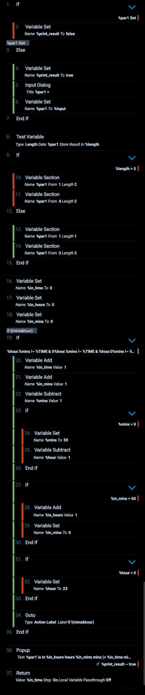

# Tasker: Prevent accidental sleep
If you have ever felt so tired in the evening that you fell asleep accidentally, without setting a wake-up alarm - then this Tasker project is for you!

## Prerequisites
Make sure you have [Tasker](https://play.google.com/store/apps/details?id=net.dinglisch.android.taskerm&hl=en_US) installed on your device _(it is available on Android)_.
 

## Main project files

### [Next_evening_Display_off_time.prf.xml](tasker/Next_evening_Display_off_time.prf.xml)
It is a Tasker ***Profile*** that initializes the _%DISPLAY_OFF_TIME_ variable - each evening, in order to activate the [Prevent accidental sleep Profile](tasker/Prevent_accidental_sleep.prf.xml).

#### 

### [Prevent_accidental_sleep.prf.xml](tasker/Prevent_accidental_sleep.prf.xml)
It is a Tasker ***Profile*** that runs the [Prevent accidental sleep Task](tasker/Prevent_accidental_sleep.tsk.xml) each 2 minutes in the evening, when the _%DISPLAY_OFF_TIME_ variable is initialized (assuming that the variable is cleared once you've gone to sleep *intentionally*).

#### 

### [Prevent_accidental_sleep.tsk.xml](tasker/Prevent_accidental_sleep.tsk.xml)

This is the main project task, that calculates for how long the phone has been locked but only when you're at your home location. It assumes that having it locked for more than _%MAX_DISP_OFF_TIME_ minutes (at home, in the evening) means you're falling asleep *unintentionally*.

#### 

Once the *accidental sleep* is detected, the [Evening Routine Task](tasker/Evening_routine.tsk.xml) is run.

### [Evening_routine.tsk.xml](tasker/Evening_routine.tsk.xml)

The Evening Routine Task might perform any custom actions. In this example:
* plays a sound to wake you up,
* asks you to set a wake up alarm,
* asks you to brush your teeth.

#### 

  

## Helper tasks

### [Insert_Morning_Routine.tsk.xml](tasker/Insert_Morning_Routine.tsk.xml)

Inserts an event called "Morning Routine" for a chosen time.

#### 

### [Mins_from__TIME__to__par1_.tsk.xml](tasker/Mins_from__TIME__to__par1_.tsk.xml) + [Mins_from__TIME__to__par1_par2_.tsk.xml](tasker/Mins_from__TIME__to__par1_par2_.tsk.xml)

These tasks the amount of minutes between 2 times, because the result is needed in some Tasker's built functions.

#### 

#### 
